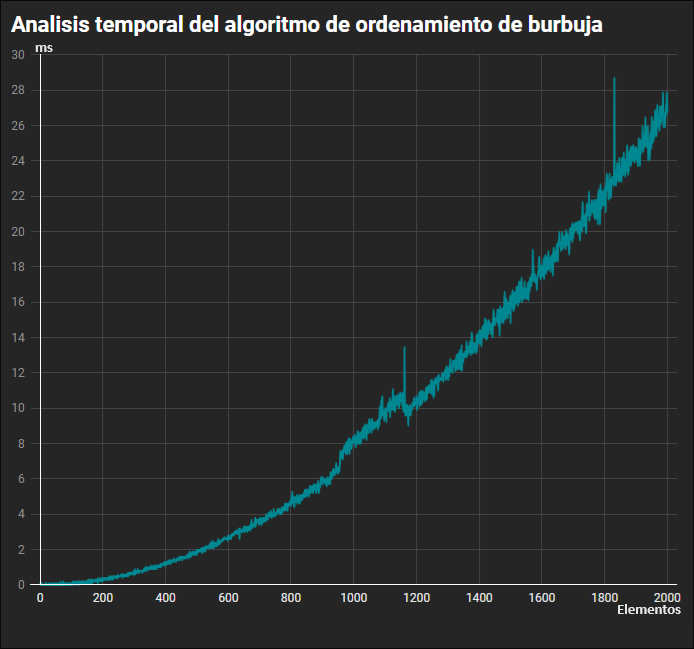
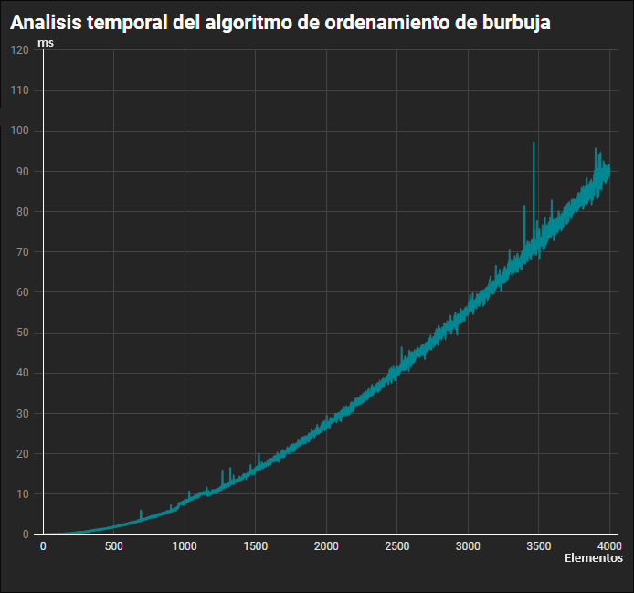
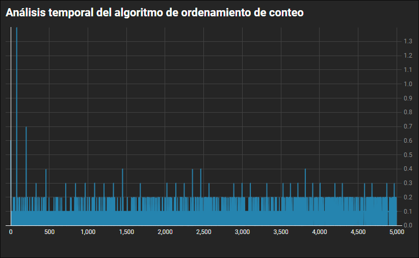
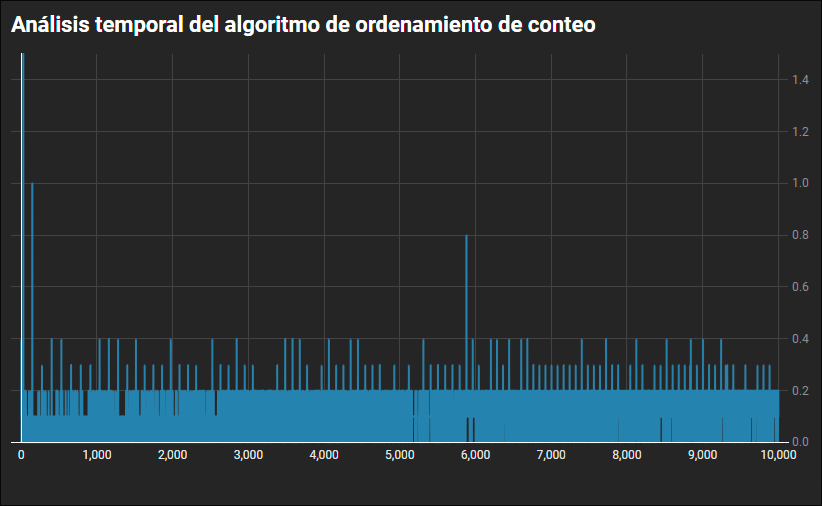
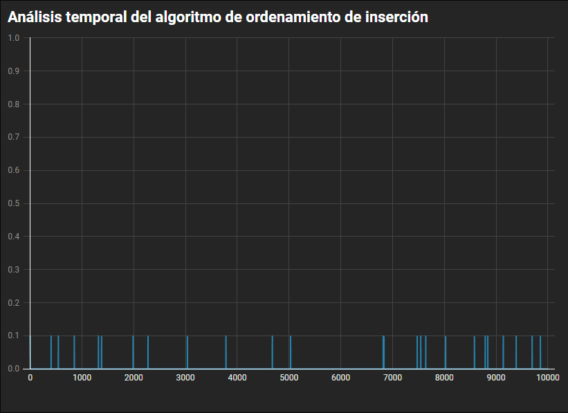

# Analisis de algoritmos

### Ejercicio

Tomar 3 de los algortimos de ordenamiento y realizar un analisis para analizar su complejidad


## 1. Algoritmo de ordenamiento de burbuja (Bubble sort)

La ordenación de burbuja es un algoritmo simple que ordena una lista permitiendo que los valores más bajos o más altos aparezcan en la parte inicial (depende de si se requiere orden ascendente o descendente). El algoritmo atraviesa una lista y compara valores contiguos, intercambiandolos si no están en el orden requerido.

Ejemplo:

```javascript
const desordenado = [4, 2, 6, 3, 9] // Arreglo a ordenar
```

#### Primera iteración de la lista:
- El algoritmo compara los dos primeros elementos del arreglo, 4 y 2. Los intercambia porque 2 < 4 y queda: [2, 4, 6, 3, 9]
- Compara los siguientes dos valores, 4 y 6. Como 4 < 6, estos ya están en orden, y el algoritmo continúa y queda: [2, 4, 6, 3, 9]
- Los siguientes dos valores también se intercambian porque 3 < 6 y queda: [2, 4, 3, 6, 9]
- Los dos últimos valores, 6 y 9, ya están en orden, por lo que el algoritmo no los intercambia.

El resultado final en esta iteración es
```[2, 4, 3, 6, 9]```

#### Segunda iteración de la lista:
- 2 < 4, por lo que no hay necesidad de intercambiar posiciones y queda: [2, 4, 3, 6, 9]
- El algoritmo intercambia los siguientes dos valores porque 3 < 4 y queda: [2, 3, 4, 6, 9]
- Luego no hay intercambio porque 4 < 6
- De nuevo, 6 < 9, por lo que no se produce intercambio:

El resultado final en esta iteración es
```[2, 4, 3, 6, 9]```

Visualmente la lista ya está ordenada, pero el algoritmo aún no ha comprobado, necesita revisar de nuevo todos los elementos sin intercambiar ningún valor para saber que la lista está ordenada.

#### Tercera iteración de la lista:

[2, 3, 4, 6, 9] => [2, 3, 4, 6, 9]
[2, 3, 4, 6, 9] => [2, 3, 4, 6, 9]
[2, 3, 4, 6, 9] => [2, 3, 4, 6, 9]
[2, 3, 4, 6, 9] => [2, 3, 4, 6, 9]

### Resultado
La complejidad temporal para ese algoritmo es de **O(n^2)** ya que se ejecuta el ciclo for tantas veces como el largo que sea el arreglo dentro de otro ciclo.




*Ejemplo en JavaScript*
```javascript

function ordenarPorBurbuja{
	let arreglito = [1, 4, 7, 45, 7,43, 44, 25, 6, 4, 6, 9]
	let ordenado = false;

	while(!ordenado) {
		ordenado = true;
		for(var i=0; i < arreglito.length; i++) {
			if(arreglito[i] < arreglito[i-1]) {
				let temp = arreglito[i];
				arreglito[i] = arreglito[i-1];
				arreglito[i-1] = temp;
				ordenado = false;
			}
		}
	}
	return arreglito
}

//         .d88888b.    .d88             o     .d8888b.  88b.
//        d88P" "Y88b  d88P"            d8b   d88P  Y88b "Y88b
//        888     888 d88P             d888b         888   Y88b
//        888     888 888    88888b.  d8P"Y8b      .d88P    888
//        888     888 888    888 "88b          .od888P"     888
//        888     888 Y88b   888  888         d88P"        d88P
//        Y88b. .d88P  Y88b. 888  888         888"       .d88P
//         "Y88888P"    "Y88 888  888         888888888  88P"

```


## 2. Algoritmo de ordenamiento de conteo (Counting sort)

El algoritmo de ordenación por conteo funciona creando primero una lista de los conteos u ocurrencias de cada valor único en la lista. Luego crea una lista ordenada final basada en la lista de conteos. Una cosa importante que debes recordar es que la ordenación por conteo solo se puede usar cuando conoces de antemano el rango de valores posibles en la entrada.

Ejemplo:

```javascript
//Tienes una lista de números enteros del 0 al 5:
const input = [2, 5, 3, 1, 4, 2]
```
Primero, debes crear una lista de recuentos para cada valor único en la lista `input`. Como sabes que el rango de la `input` es de 0 a 5, puedes crear una lista con cinco marcadores de posición para los valores del 0 al 5, respectivamente:

```javascript
count = [0, 0, 0, 0, 0, 0]
// val:  0  1  2  3  4  5
```
Luego, revisas la lista `input` e iteras el índice para cada valor en uno. Por ejemplo, el primer valor en la lista `input` es 2, por lo que agrega uno al valor en el segundo índice de la lista `count`, que representa
el valor 2:

```javascript
count = [0, 0, 1, 0, 0, 0]
// val:  0  1  2  3  4  5
```

El siguiente valor en la lista `input` es 5, por lo que agrega uno al valor en el último índice de la lista `count`, que representa el valor 5:

```javascript
count = [0, 0, 1, 0, 0, 1]
// val:  0  1  2  3  4  5
```

Continúa hasta que tengas el recuento total de cada valor en la `entrada`
lista:

```javascript
count = [0, 1, 2, 1, 1, 1]
// val:  0  1  2  3  4  5
```

Finalmente, dado que sabes cuántas veces aparece cada valor en la lista `input`, puedes crear fácilmente una lista `output` ordenada. Un ciclo a través de la lista `recuento`, y para cada recuento, agrega el valor correspondiente (0 - 5) al arreglo `output` tantas veces.

Por ejemplo, no había 0 en la lista de `input`, pero había una aparición del valor 1, por lo que se agrega ese valor al arreglo `output` una vez:

```javascript
output = [1]
```

Luego hubo dos apariciones del valor 2, por lo que las agrega a la
lista `output`:

```javascript
output = [1, 2, 2]
```

Y así sucesivamente hasta que tengas la lista final ordenada de "salida" (output):

```javascript
output = [1, 2, 2, 3, 4, 5]
```


### Resultado
La complejidad temporal para este algoritmo es de **O(n)** ya se ejecutan una serie de pasos basados en una constante y luego se ejecutan varios ciclos for.





*Ejemplo en JavaScript*
```javascript
let numbers = [1, 4, 1, 2, 7, 5, 2];
let count = [];
let output =[];
let i = 0;
let max = Math.max(...numbers);


for (i = 0; i <= max; i++) {
  count[i] = 0;
}


for (i = 0; i < numbers.length; i++) {
  output[i] = 0;
}

for (i = 0; i < numbers.length; i++) {
  count[numbers[i]]++;
}

for (i = 1; i < count.length; i++) {
  count[i] += count[i-1];
}

for (i = numbers.length - 1; i >= 0; i--) { 
  output[--count[numbers[i]]] = numbers[i];
}

// arreglo ordenado de salida
for (i = 0; i < output.length; i++) {
  console.log(output[i]);
}

//  .d88888b.    .d88          88b.   
// d88P" "Y88b  d88P"          "Y88b  
// 888     888 d88P              Y88b 
// 888     888 888    88888b.     888 
// 888     888 888    888 "88b    888 
// 888     888 Y88b   888  888   d88P 
// Y88b. .d88P  Y88b. 888  888 .d88P  
//  "Y88888P"    "Y88 888  888 88P"   
```

## 3. Algoritmo de ordenamiento de inserción (Insertion sort)

La ordenación por inserción es un algoritmo de ordenación simple para una pequeña cantidad de elementos.

En la ordenación por inserción, compara el elemento `key` con cada uno de los elementos anteriores. Si el inmediatamente anteriores es mayor que el elemento `key`, mueve el elemento anterior a la siguiente posición y realiza de nuevo la comparación con el elemento aterior hasta terminar el en el primer índice.

Comienza desde el segundo índice `[1]` hasta el tamaño del arreglo de entrada.

Ejemplo:

```javascript
const array=[8,3,5,1,4,2];
```

#### Paso 1:

key = 3 //a partir del segundo índice.

Aquí `key`(clave) se comparará el elemento anteriore.

En este caso, `key` se compara con 8. como 8 > 3, mueve el elemento a la siguiente posición e inserta `key` en la posición anterior.

```javascript
console.log(array);
//Muestra: [3,8,5,1,4,2]
```

#### Paso 2 :
key = 5 // Es el tercer indice del arreglo

8 > 5 // mueve 8 al tercer índice e inserta 5 en el segundo índice.

```javascript
console.log(array);
//Muestra: [3,5,8,1,4,2]
```

#### Paso 3 :
key = 1 //Cuarto índice
Compara la clave con CADA uno de los anteriores para mover el indice clave una posición atrás si se cumple la regla.
8 > 1 => [3,5,1,8,4,2]

5 > 1 => [3,1,5,8,4,2]

3 > 1 => [1,3,5,8,4,2]


```javascript
console.log(array);
//Muestra: [1,3,5,8,4,2]
```

#### Paso 4 :
key = 4 // Quinto índice
Igual que en el paso tres, pero cuando encuentra que el número anterior es menor no mueve el elemento y para.

8 > 4 => [1,3,5,4,8,2]
5 > 4 => [1,3,4,5,8,2]
3 > 4 ≠> Parar!

```javascript
console.log(array);
//Muestra: [1,3,4,5,8,2]
```
Result: 

#### Paso 5 :
key = 2 // Sexto índice
Igual que en el paso cuatro.

8 > 2 => [1,3,4,5,2,8]

5 > 2 => [1,3,4,2,5,8]

4 > 2 => [1,3,2,4,5,8]

3 > 2 => [1,2,3,4,5,8]

1 > 2 ≠> stop

```javascript
console.log(array);
//Muestra: [1,2,3,4,5,8]
```
### Resultado

La complejidad temporal para ese algoritmo es de **O(n)** el recorrido lo hace mediante una estructura de control `while` casi actuando como un ciclo for y aunque dentro existe un ciclo whilo, lo que realiza no es exhaustivo en cuanto al recorrido y comparación, haciendo que no tenga una complejidad temporal alta.




*Ejemplo en JavaScript: El algoritmo que se muestra a continuación es una versión ligeramente optimizada para evitar cambiar el elemento key  en cada iteración. Aquí, el elemento  key se intercambiará al final de la iteración (paso).*
```javascript
const arr=[8,3,5,1,4,2];
const len = arr.lenght;
const indice = 1;
while (indice < len) {
	const key = arr[indice];
	let anterior = indice - 1;
	while (anterior >= 0 && arr[anterior] > key) {
		arr[anterior + 1] = arr[anterior];
		anterior = anterior - 1;
	}
	arr[anterior+1] = key;
	indice++;
}

//  .d88888b.    .d88          88b.  
// d88P" "Y88b  d88P"          "Y88b 
// 888     888 d88P              Y88b
// 888     888 888    88888b.     888
// 888     888 888    888 "88b    888
// 888     888 Y88b   888  888   d88P
// Y88b. .d88P  Y88b. 888  888 .d88P 
//  "Y88888P"    "Y88 888  888 88P"  
```