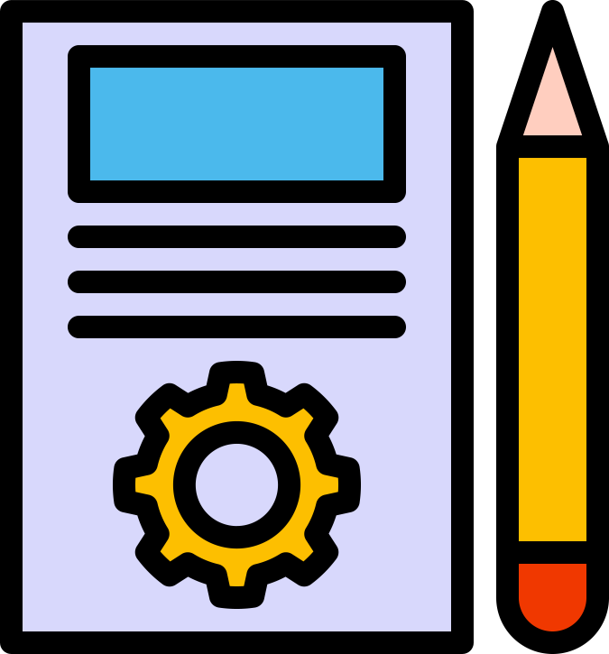

# Talento Tech
Este repositorio consta de los ejercicios realizados para el bootcamp de Talento Tech

En [https://chybeat.github.io/TalentoTech-intermedio/](https://chybeat.github.io/TalentoTech-intermedio/) se encuentran todos los ejercicios ordenados por el mas reciente primero.

## Lista de tareas
***Fecha**: Septiembre 16 de 2024 - Ejercicio 4*

<a href="https://chybeat.github.io/TalentoTech-intermedio/002-Inventario/"></a>

FALTA EL OBJETIVO
```
FALTA POR HACEEEEEEEEEEERRRRRRRRR!!!
```

<a href="https://chybeat.github.io/TalentoTech-intermedio/006-Lista-de-tareas/">
</g></svg></a>

### Código del ejercicio

<a href="https://github.com/chybeat/TalentoTech-intermedio/blob/main/006-Lista-de-tareas/index.html"></a>
<a href="https://github.com/chybeat/TalentoTech-intermedio/blob/main/006-Lista-de-tareas/006-Lista-de-tareas.css"></a>
<a href="https://github.com/chybeat/TalentoTech-intermedio/blob/main/006-Lista-de-tareas/006-Lista-de-tareas.js"></a>


## Analisis de algoritmos
***Fecha**: Septiembre 13 de 2024 - Ejercicio 3*

<a href="https://github.com/chybeat/TalentoTech-intermedio/blob/main/005-Analisis-de-algoritmos/"></a>

El objetivo es tomar 3 de los algortimos de ordenamiento y realizar un analisis para analizar su complejidad.

<a href="https://github.com/chybeat/TalentoTech-intermedio/blob/main/005-Analisis-de-algoritmos/README.md">
</g></svg></a>


## Inventario
***Fecha**: Septiembre 9 de 2024 - Ejercicio 2*

<a href="https://chybeat.github.io/TalentoTech-intermedio/002-Inventario/"></a>

El objetivo es realizar una inerfaz para el manejo del inventario en una papelría donde se puedan agregar nuevos productos, eliminar y consultar los elementos actuales en el inventario.

<a href="https://chybeat.github.io/TalentoTech-intermedio/002-Inventario/">
</g></svg></a>

### Código del ejercicio

<a href="https://github.com/chybeat/TalentoTech-intermedio/blob/main/002-Inventario/index.html"></a>
<a href="https://github.com/chybeat/TalentoTech-intermedio/blob/main/002-Inventario/003.Ejercicio-Inventario.css"></a>
<a href="https://github.com/chybeat/TalentoTech-intermedio/blob/main/002-Inventario/003.Ejercicio-Inventario.js"></a>

## Calculadora
***Fecha**: Septiembre 6 de 2024 - Ejercicio 1*


El objetivo es realizar una calculadora con dos elementos de entrada (numeros) y cuatro botones que ejecuten las operaciones básicas: Suma, Resta, Multiplicación y División con esos dos números. Es importante tener un apartado o área para mostar el resultado.

<a href="https://chybeat.github.io/TalentoTech-intermedio/001-Calculadora/">
</g></svg></a>

### Código del ejercicio
<a href="https://github.com/chybeat/TalentoTech-intermedio/blob/main/001-Calculadora/index.html"></a>
<a href="https://github.com/chybeat/TalentoTech-intermedio/blob/main/001-Calculadora/002.Ejercicio-calculadora.css"></a>
<a href="https://github.com/chybeat/TalentoTech-intermedio/blob/main/001-Calculadora/002.Ejercicio-calculadora.js"></a>
